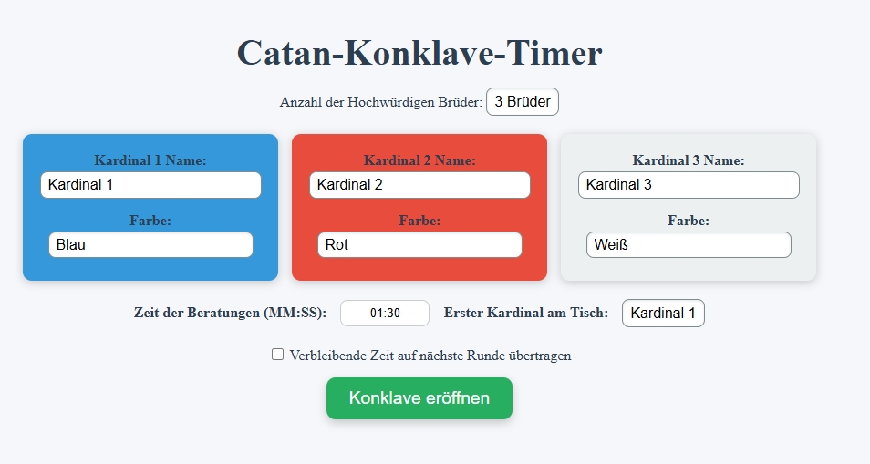
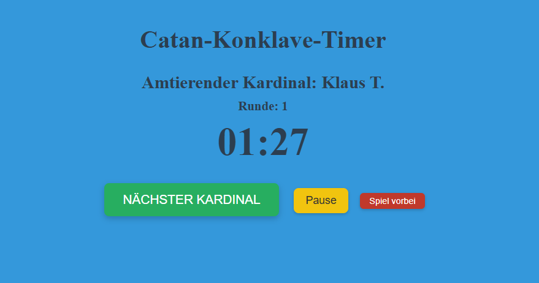

# Catan Timer
Dieses Projekt ist ein einfaches Web-Interface, um bei einer Runde Catan die Spielzeit zu tracken - ähnlich einer Schach-Uhr. Dadurch soll unnötige Downtime beim Spielen reduziert werden.

# Features
- 3-6 Spieler
- Zeit einstellbar
- Runden-Counter
- Addierung der verbleibenden Zeit auf die nächste Runde

# Screenshots



# Installation
1. Klone das Repository:
   ```bash
   git clone

2. Im Ordner des Repositories:
   ```bash
   docker-compose pull && docker-compose up -d
   
3. ```https://0.0.0.0:8000``` im Browser öffnen.

